## Examples
[back](README.md)

Example runs of the simulator are given below:
1. [Displaying a graph](#example-1)
2. [Adding nodes and edges to a graph](#example-2)
3. [Removing a nodes and edges from a graph](#example-3)
4. [Running Dijkstra's in the simulator](#example-4)
5. [Unreachable Paths](#example-5)

### Example 1
Displaying a Graph

Once you have the `ThreeTenGraph<V,E>` class working, you can run the main program to test and debug. The main program is `SimGUI`, which can be compiled and run with the following commands if you are on Windows:

```
javac -cp .;310libs.jar *.java
java -cp .;310libs.jar SimGUI
```

or the following commands if you are on Linux/MacOS:

```
javac -cp .:310libs.jar *.java
java -cp .:310libs.jar SimGUI
```

Why is there extra stuff? The `-cp` is short for `-classpath` (meaning "where the class files can be found). The `.;310libs.jar` or `.:310libs.jar` has the following components: `.` the current directory, `;` or `:` the separator for Windows or Linux/MacOS respectively, `310libs.jar` the provided jar file which contains the library code for JUNG.

If you run the simulator with the above command, you will get a six node graph with some random edges. Each time you hit "reset" you get another graph, but the same sequence of graphs is always generated (for your testing). However, the simulator can also be run with some additional optional parameters to get some more interesting results: The number of nodes, the likelihood that two nodes have an edge between them, the random seed for the graph generator. For example:

Image|Command|Explanation
:---: | :---: | :---:
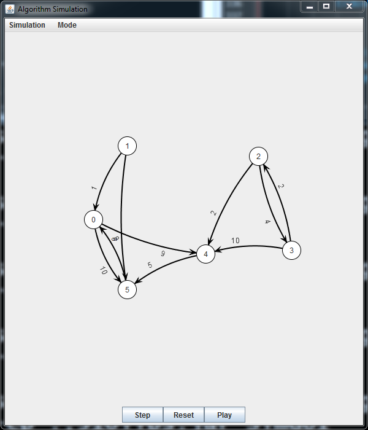|`java -cp .;310libs.jar SimGUI`|Generate a six node graph, with connection probability of 0.4, and seed 0.
|`java -cp .;310libs.jar SimGUI 10 1`|Generate a ten node graph where all nodes are connected.
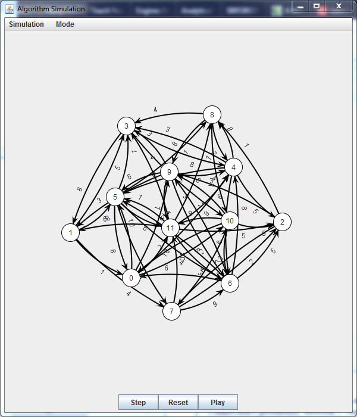|`java -cp .;310libs.jar SimGUI 12 0.5`|Generate a twelve node graph where nodes have a 50% chance of being connected.
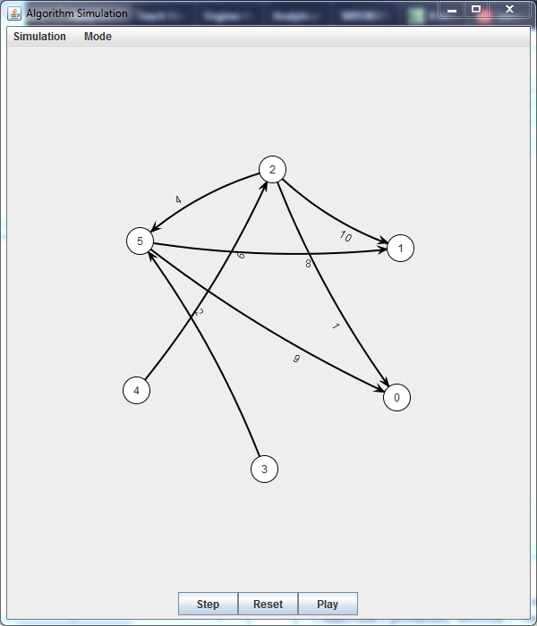|`java -cp .;310libs.jar SimGUI 6 0.4 1123`|Generate a difference sequence of graphs using seed 1123.

### Example 2
Adding nodes and edges to a graph

You'll want to test out adding multiple nodes and edges from your graphs to make sure you've gotten out all the bugs.

Image|Explanation
:---: | :---:
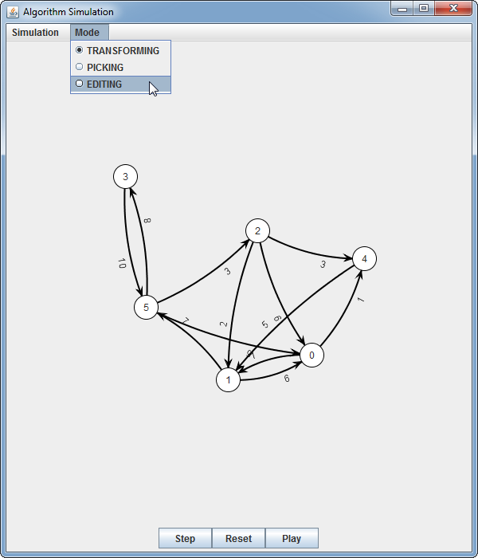|Select "Mode", then "Editing".
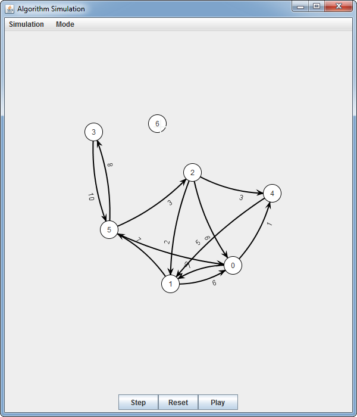|Click Anywhere on the graph surface to add a node.
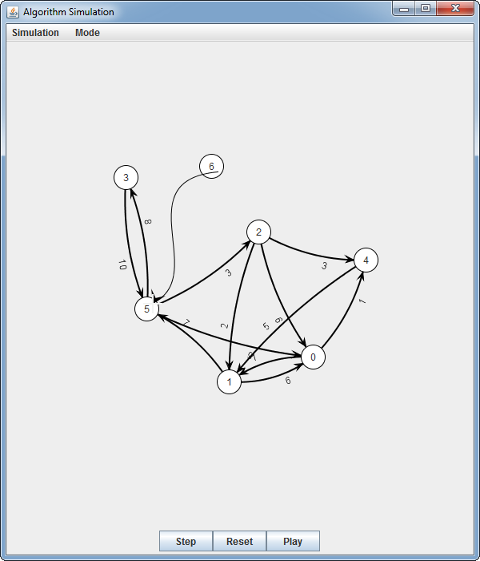|Drag to another node to add an edge with a random weight.

### Example 3
Removing a nodes and edges from a graph

You'll want to test out removing multiple nodes and edges from your graphs to make sure you've gotten out all the bugs.

Image|Explanation
:---: | :---:
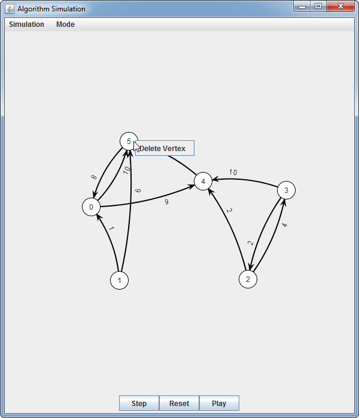|In any mode, right click a node and select "delete vertex".
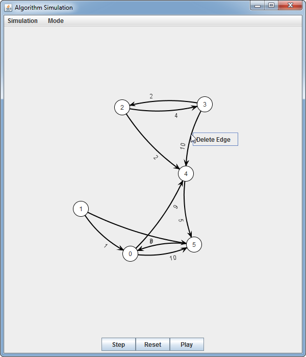|In any mode, right click an edge and select "delete edge".

Image|Explanation
:---: | :---:

### Example 4
Running Dijkstra's in the simulator

You can try out Dijkstra's algorithm one step at a time to help debugging your code.

Image|Explanation
:---: | :---:
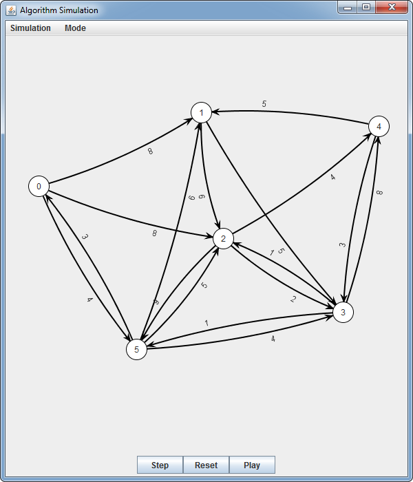|Setup your graph (you can zoom with mouse scroll)
|Hit "Step" (nodes should now show distances)
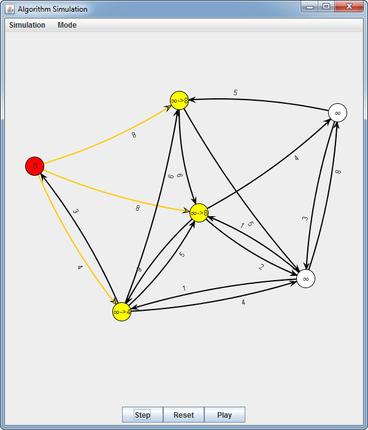|Hit "Step" (smallest node is picked, edges are highlighted, and neighbors show their updates)
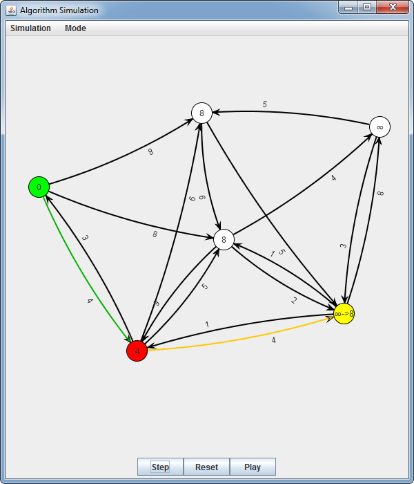|Hit "Step" (previous node is finished, next smallest node is picked...)
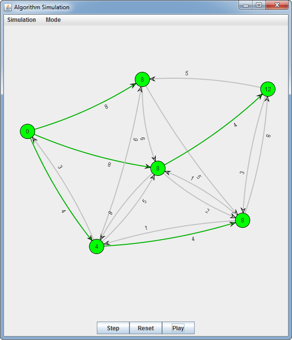|Hit "Play" (will complete the algorithm, used edges are in green and others are grey)

### Example 5
What happens for unreachable paths?

The simulator should still step through all nodes (because this is what Dijkstra's algorithm does). However, the parent pointer for nodes that are "infinitely far away" is never set, so there are no green edges.

Image|Explanation
:---: | :---:
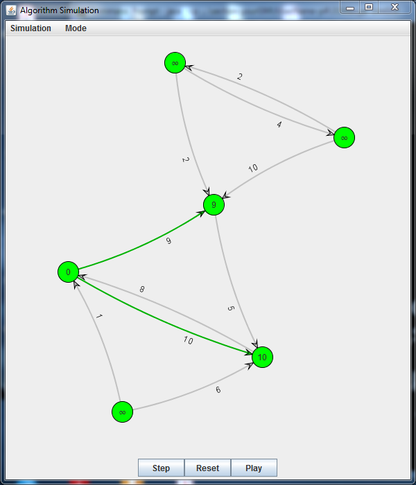|Completed run for a graph with unreachable nodes.